## Code for Undergraduate Thesis

### Brief Introduction

The project is addressing visual place recognition, which is an attentive and challenging topic in CV or robotic community.

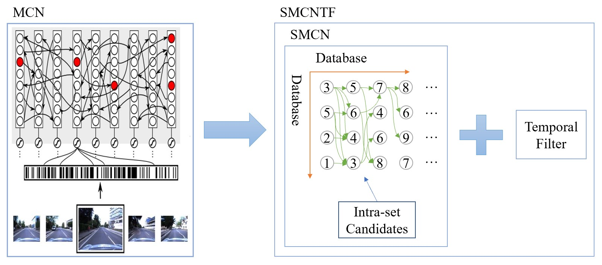

<br>

**1. How SMCN come into being**

Since March this year, I noticed the paper --《A neurologically inspired sequence processing model for mobile robot place recognition》. Although I was impressed by the bio-inspired appoach, I think I can do more. The initial thought came to me was that the learning rules in MCN may be modified to yield better performance. However that failed to work. During that time, I reimplement MCN code with python, which deepened my understanding of what MCN actually does. After lots of debuging, I think why we make MCN more simple by retaining its core idea and abandoning its complex data struture. Finally I rewrited all the code and named it SMCN for simplified MCN.

---

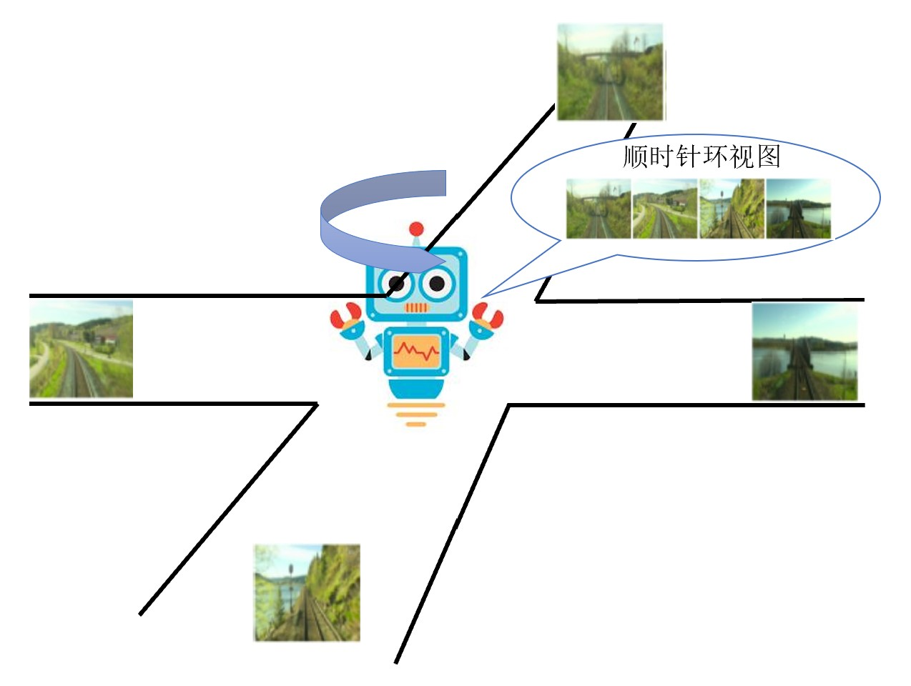
<br>

**2. Applying to panoramic scene**

Most of work discuss VPR on single-view datasets, which are collected with a monocular camera. However, it's worth noting that robots allow for a wider range of vision than human. That's why applying VPR methods to panoramic scene is an important but less attentive yet issue. We assume that the robot collect image via a rotated monocular camera. Each location takes 4 images evenly. We design experments to demonstrate the panoramic dataset is beneficial to VPR. We also apply our SMCN to the new dataset.

## Setup

### Environment

For saving time, I coded with my laptop and ran it on [Cloud Server](https://www.matpool.com/host-market?type=CPU) with better CPU. But I think normal laptop can run the code as well.
Here is the configuration of the mentioned devices.
|Device|Brand|CPU|RAM|OS|
|:---:|:---:|:---:|:---:|:---:|
|My laptop|XiaoXinPro13 2020|AMD Ryzen 5 4600U|16GB|Win 10|
|Cloud server|/|Intel Xeon with 4 cores|8GB|Linux|

### Python libraries
All code wrote with Python 3.x and following libraries should be installed in advance.

- numpy
- scipy
- pytorch
- matplotlib
- pyyaml
- pillow
- opencv-python
- sklearn
- gmplot(visualize gps coordinate, not important)
- cvs(read gps from Excell)
- colour-demosaicing(use to read Bayer pattern images from Oxford Robotcar. If you use our preprocessed images, it's optional.)
- tqdm(optional, if you know how to modify ex3_4_Delta_AP.py)

### Datasets

All datasets used in paper are stored at [Google Drive](https://drive.google.com/drive/folders/1xF0x9ou6-68xdCQve-51-Ozgro-NLlIS)


## Usage

### Brief introduction of directory

- main(contain the major codes)
- tools(some scripts for simple application like metric calculation, visulization and so on)
- experiments(contain all experiment code in paper which will be detailed below)
- img(not important, just for README)

### Initalization

**1. Prepare the directories that need**

Assume we are in the root directory, we open a terminal.

```
cd tools
python make_dirs.py ../
```

**2. Put datasets in ```./datasets```**

Take Nordland for example. You should put it in this way:

```
/datasets
    /nordland
        /spring
        /summer
        /fall
        /winter
```

**3. Extract descriptors from dataset**

Front-end models used in paper are stored at:
NetVLAD --> [Google Drive](https://drive.google.com/open?id=17luTjZFCX639guSVy00OUtzfTQo4AMF2)
AlexNet --> [link](https://download.pytorch.org/models/alexnet-owt-4df8aa71.pth)
You should download them and put them in ```/model```.
Then open ```main/config.yaml``` and specify parameters. Take nordland dataset and NetVLAD as example.
```
--- config.yaml --- 
dataset:
    root: '../datasets'
    name: 'nordland'
    subdir:
        -  'spring'
        -  'summer'
        -  'fall'
        -  'winter'
    postfix: ''
    numformat: '%d'
    suffix: '.png'
    err: 9

    resize:
        h: 224
        w: 224

net:
    nGPU: 1
    threads: 12
    batch_size: 16
    net_name: 'netvlad'
    resume_model: '../model/netvlad.pth'
    save_desc: '../desc'
    pca_flag: false     # True is not recommended
    pca_dims: 128
```
Comment other dataset and net, detailed infomation is in ```config.yaml```.
Finally you run ```main/make_desc.py```, the descriptors will be saved in ```desc/netvlad/nordland```. 

### Experiments

All experimental results files are available at [Google Drive](https://drive.google.com/drive/folders/1uvrauyCBi_SexnudkXthXUFEdBwLPzHm)

**1. cp3_1**

cp3_1 means the first experiment in chapter 3 of my undergraduate thesis(对应3.3.1 MCN存在问题的实验分析). At the same time, the result is also used in my paper(Sec. 4.3 Instability of MCN).
```ex3_1.py``` shows how to use the code.
**2. cp3_2**

cp3_2 corresponds to 3.3.2(候选矩阵的必要性).

**3. cp3_3**

cp3_3 traverses hyper-parameters in SMCN(对应3.3.3 SMCN的超参数的讨论), which is also included in my paper(Sec. 4.4 Hyperparameters of SMCN).

```
/cp3_3
    ex3_3.py        # traverse hyper-parameters and save result
    ex3_3_vis.py    # visual the result
    *.npy           # result saved
```

**4. cp3_4**

cp3_4 evaluate all methods with 2 front-end descripors on 4 datasets(10 combinations). 对应3.3.4.2 AP 指标. In paper, it shows at Sec. 4.5 VPR performance.

```
/cp3_4
    ex3_4.py            # test PW, PWk, MCN, SMCN, SMCNTF
    ex3_4_Delta_AP.py   # test Delta Descriptor
    ex3_4_SeqSLAM_AP.py # test SeqSLAM, the similarity matrix is obtained from matlab
    seqslam/            # store similarity matrix *.mat
    table.html          # latex code for table showing our result
```

**5. cp4**

cp4 simulate VPR on panoramic scene. ```ex4_1.py```对应4.3.1 环视数据集优越性的证明. ```ex4_2.py```对应4.3.2 后端方法在环视数据集上的应用。Two Python scripts, namely ```get_result_for_video.py and omni_video.py``` are used for video visualization which is more intuitive.

### Visualization

cp3_5 contains the codes for visualization. Some figures are used in my undergraduate thesis.

**1. ex3_5_vis1.py**

This code is used for plotting PR curves. When you want to run this code, you should know where you store the similarity matrix(```*.npz or *.mat```) for different methods. Here are some demo.

<p align="middle">
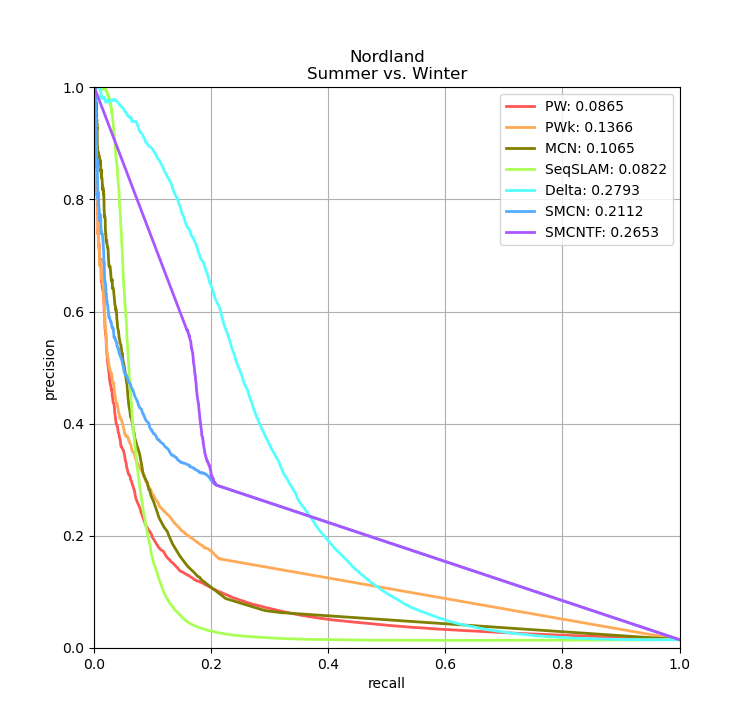
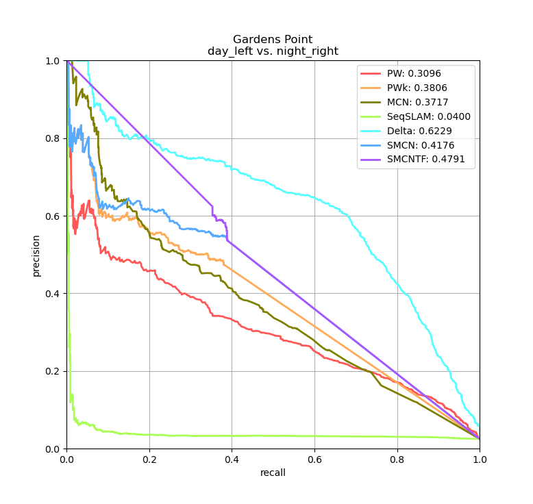<br>
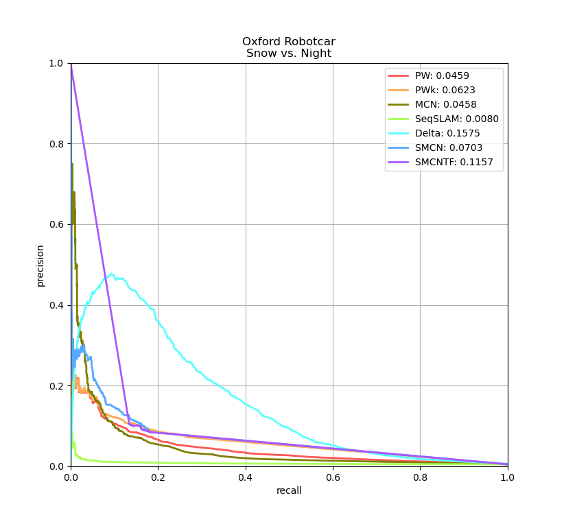
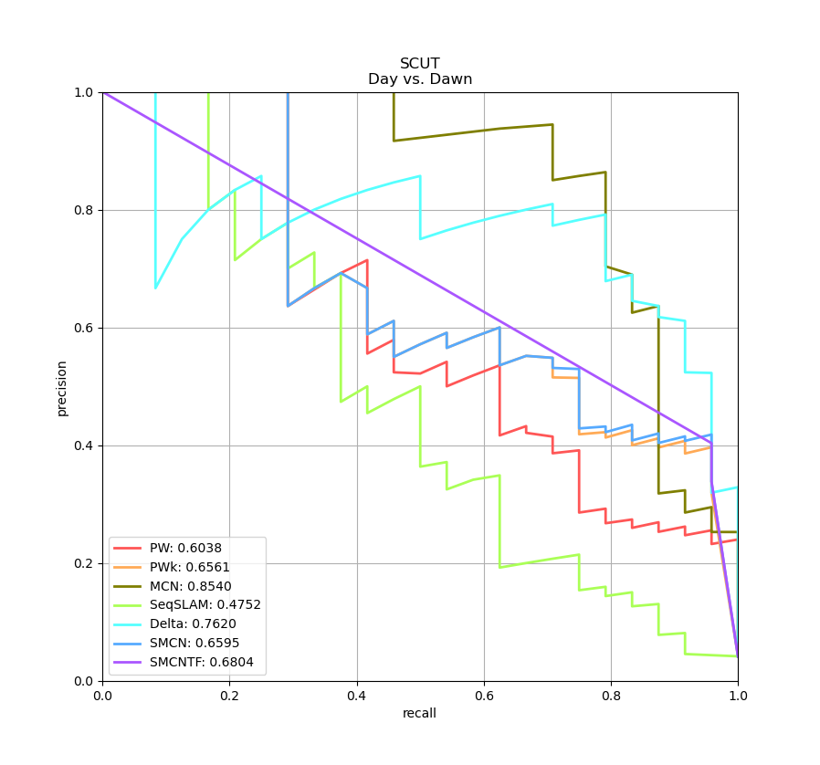
</p>

**2. ex3_5_vis2.py**

This code visualizing top1 image retrieval. Use Gardens Point(day_left vs. night_right) with NetVLAD as demo. Some good and bad examples are shown below.

**Good one**

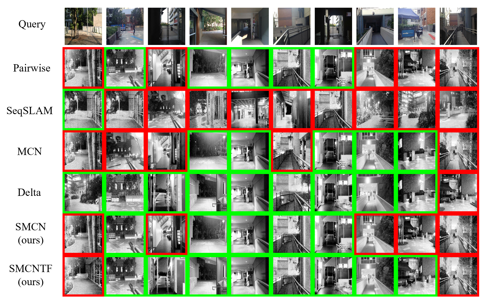

**Bad one**

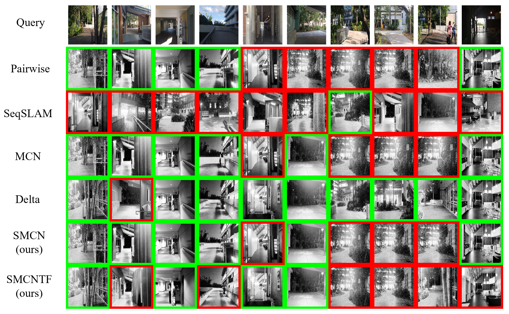

**3. ex3_5_vis3.py**
This code visualizing top10 image retrieval for one image. Use Oxford Robotcar(snow vs. night, really hard one so performance may be poor) with NetVLAD as demo. Some good and bad examples are shown below.

**Good one**

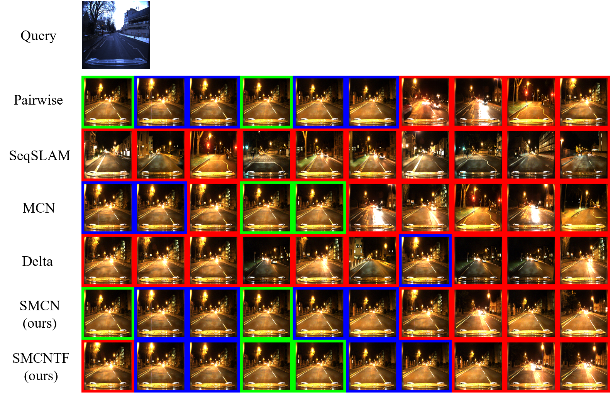

**Bad one**

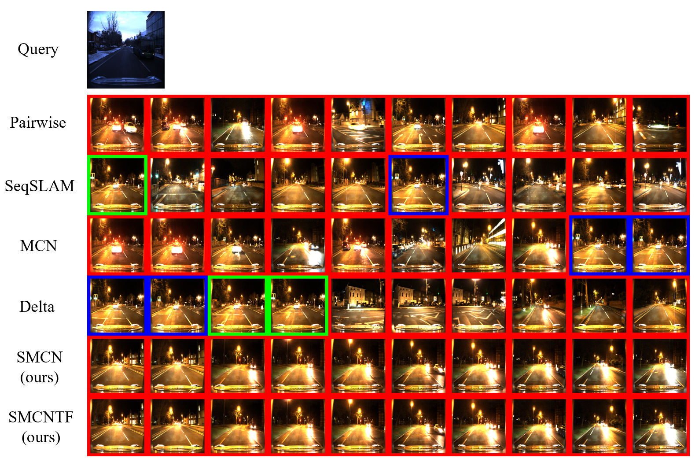

**4. vis_video.py**
This script is from cp3_5 as well, which generates a demo video showing actual VPR application on 4 datasets we used in thesis. The demo video can be found in ```/video/backend.mp4```.

**5. omni_video.py**
This script is for intuitive demonstration for the superiority when using panoramic dataset. From the short video, we can tell that approximately 1% memory consumption assisted with our proposed backend method yeilds equal performance as full dimension NetVLAD descriptor. The demo video can be found in ```/video/omni.mp4```

### Our Python Implementation of MCN vs. Original Implementation with Matlab 

In the experiment, our methods are compared with MCN of python version, which is also coded by us under guidance of original code in Matlab. It is very important to make sure our implementation should be consistent with original one. Here we prove it by experiment.

#### Setup
* Nordland-288 image descriptors(summer vs. winter) extracted with AlexNet(provided by original code)
* Gardens Point-200 image descriptors(day_right vs. day_left) extracted with NetVLAD(ours)
* MCN parameters are the same between Matlab and Python version.

#### PR Performance

* Nordland
<p align="middle">
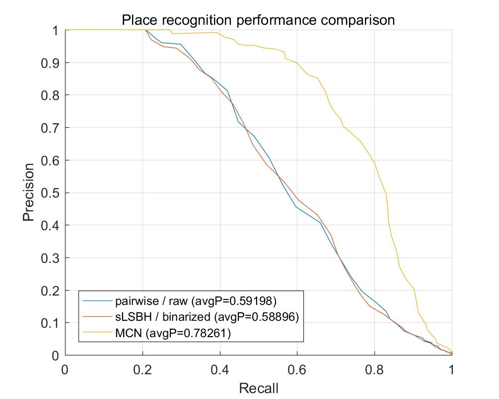
  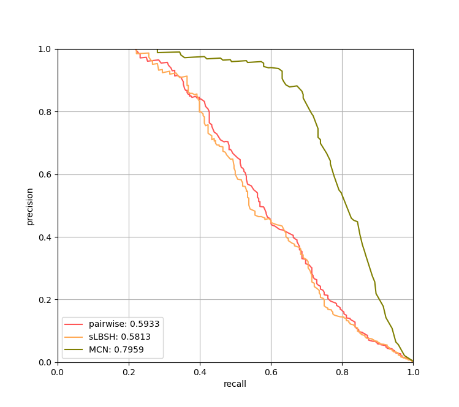
</p>


* Gardens Point
<p align="middle">
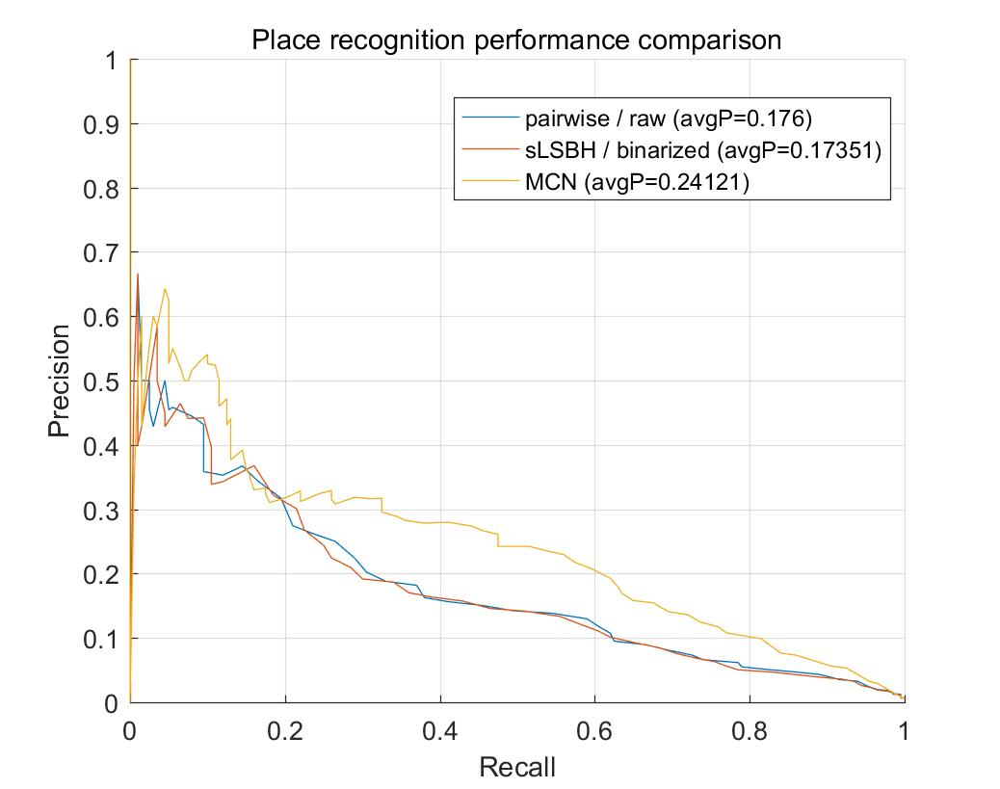
  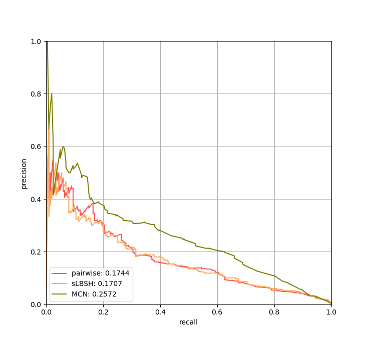
</p>

Our implementation even performs a bit better than the original version, as we can infer from figure above.
#### Runtime performance

| |Nordland|Gardens Point|
|---|---|---|
|Matlab|33.238s|17.937s|
|Python|63.577|34.594|

Python implementation is 2-fold slower than Matlab approximately. To be fair, we conduct all experiments with Python. The Runtime of MCN shows in our paper may be too long, which is in conflict with result shown in original paper. But it really SLOW!!! with python. Even if we shorten 2 times of MCN, our SMCN still greatly outperforms MCN with respect to computing efficiency. 


